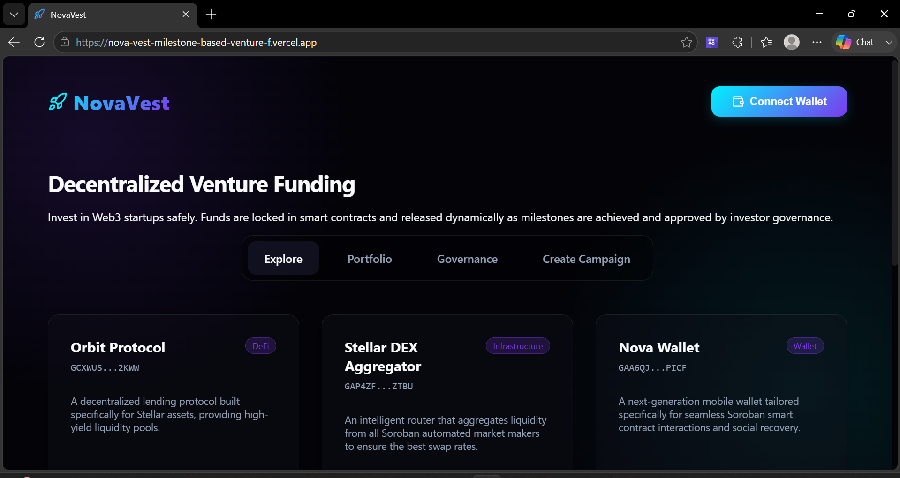
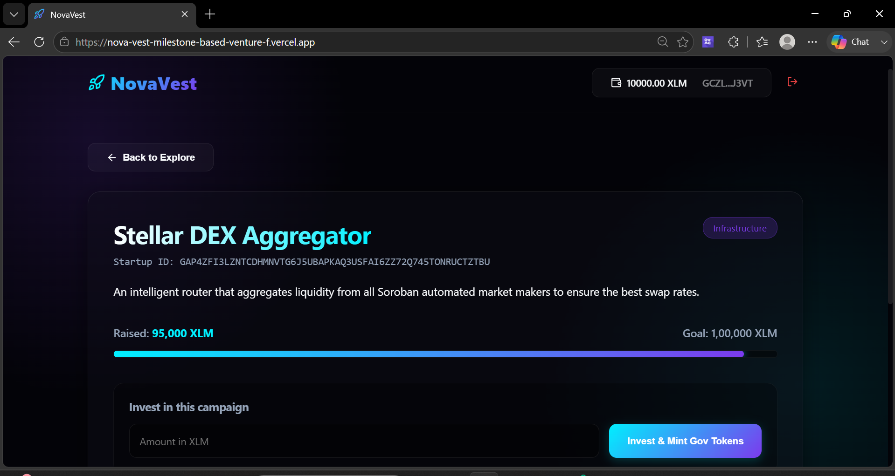
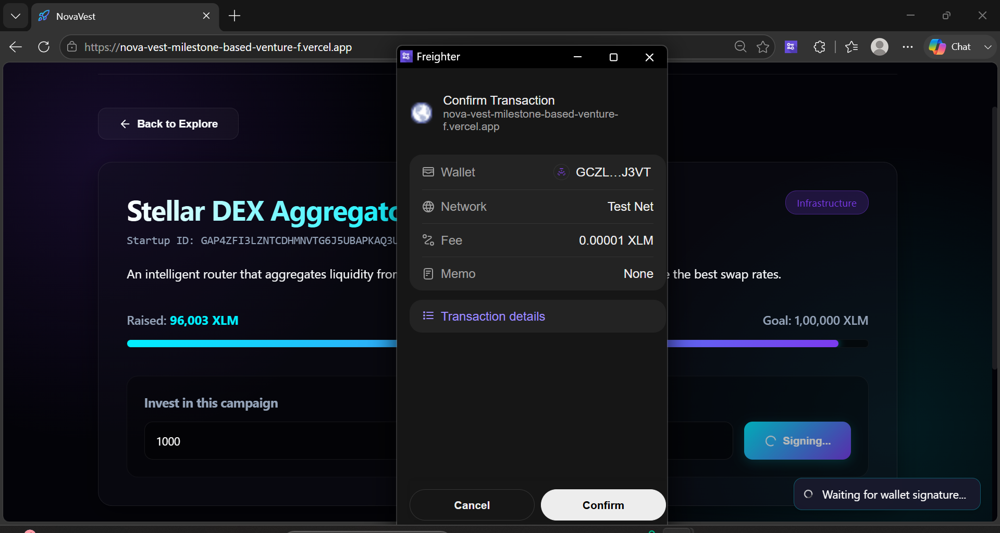
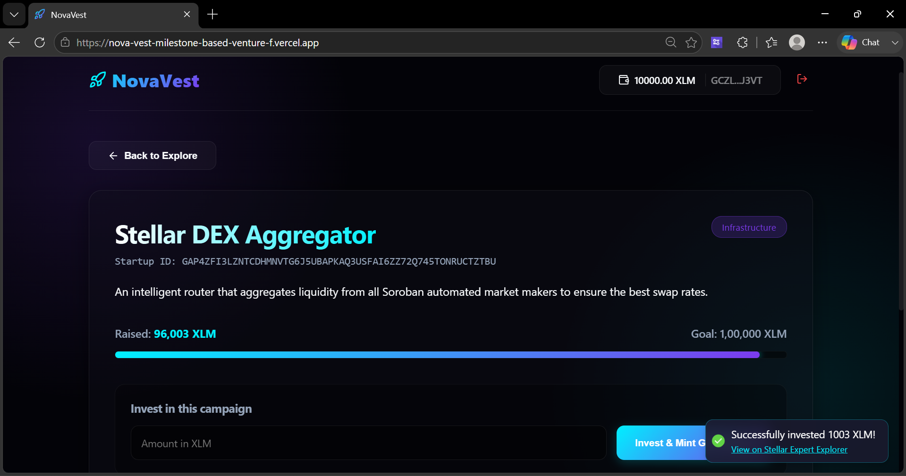
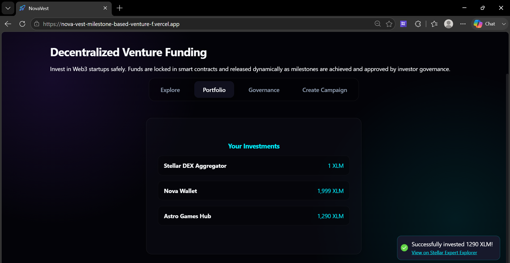
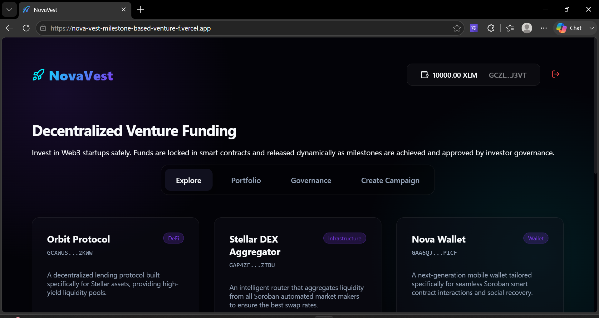
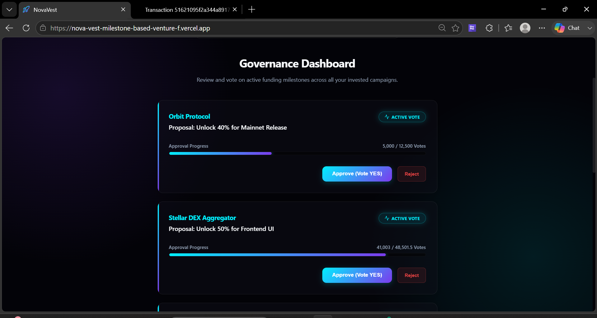
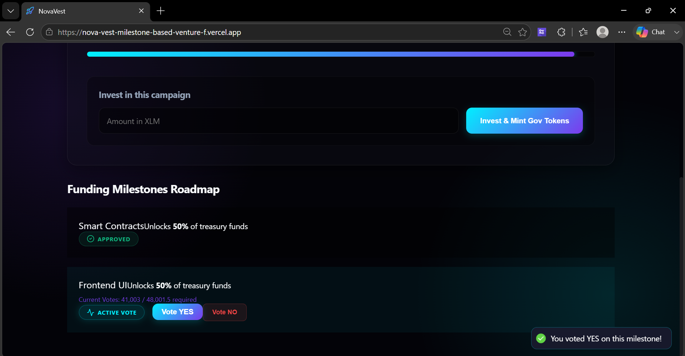

# 🚀 NovaVest - Decentralized Milestone-Based Venture Funding

NovaVest is an advanced, production-ready decentralized Venture Funding Platform built on Stellar (Soroban). It solves the web3 "rug pull" problem by locking startup funds in a Smart Contract Vault and releasing them only when investors vote to approve predefined milestones.

## 🔗 Live Demo & Video Pitch
- **Live Platform**: [nova-vest-milestone-based-venture-f.vercel.app](https://nova-vest-milestone-based-venture-f.vercel.app/)
- **Demo Video**: [Watch the Demo on Google Drive](https://drive.google.com/file/d/1rJg1da4KQjCT_VO30-phupnAD05b-yll/view?usp=sharing)

## 🌟 Key Features

1. **Milestone-based Escrow**: Startups define milestones (e.g., Alpha Launch = 30% of funds). Capital is locked and protected.
2. **Decentralized Governance**: Investors act as a DAO, voting YES/NO on milestone releases. >50% approval automatically unlocks funds.
3. **Real Wallet Integration**: Full Freighter wallet connection with live balance tracking and cryptographic transaction signing on the Stellar Testnet.
4. **Premium UI**: Built with React, Vite, and Vanilla CSS featuring a stunning dark mode, glassmorphism, and neon accents. Fully mobile responsive.

---

## 📸 Platform Gallery

### 1. The Explore Dashboard
Browse high-quality, verified Web3 startups seeking funding.


### 2. Campaign Details & Investment
Deep dive into a startup's vision, view their funding progress, and invest XLM directly.


### 3. Live Freighter Signature & Investment
Real-time integration with the Freighter Wallet to securely sign Soroban transactions.


### 4. Successful Investment Notification
Live feedback and transaction tracking on the Stellar Expert Explorer.


### 5. Investor Portfolio
Track all your active investments and live wallet balances in one place.

<br />


### 6. Decentralized Governance
Vote on active startup milestones to decide if they should receive their next tranche of funding.

<br />


### 7. Propose New Campaign
Submit your own Web3 startup for community funding, complete with automated 3-stage milestone tracking.


---

## 🛠️ Tech Stack & Architecture

- **Frontend**: React, Vite, TypeScript, Vanilla CSS (Glassmorphism UI)
- **Blockchain**: Stellar Network, Soroban Smart Contracts
- **Wallet Integration**: `@stellar/freighter-api`, `@stellar/stellar-sdk`
- **CI/CD**: GitHub Actions (Automated testing & deployments)
- **Deployment**: Vercel

## 🚀 Setup & Deployment

### Run Locally
```bash
cd frontend
npm install
npm run dev
```

### Run Tests
```bash
cd frontend
npm run test
```
